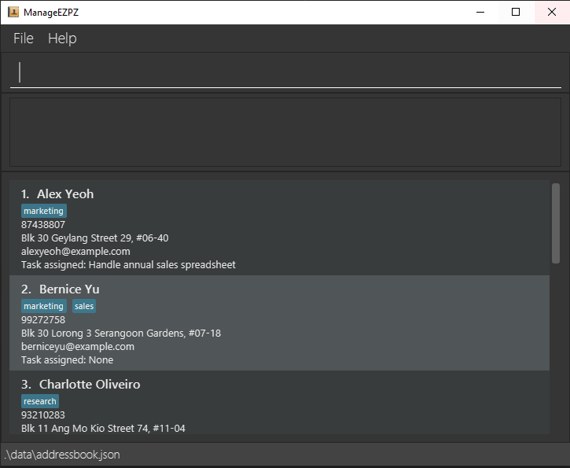

# ManageEZPZ

* This is an application for managers and/or supervisors who has alot of day to day tasks and employees to keep track of.  

  <b>Example usages:</b>
  * add day-to-day tasks
  * view all day-to-day tasks to have a better picture of the current schedule
  * view a specific day-to-day task
  * edit day-to-day tasks when details of said task has been changed

* Project code is based on [Address Book Product Website](https://se-education.org/addressbook-level3)**.

